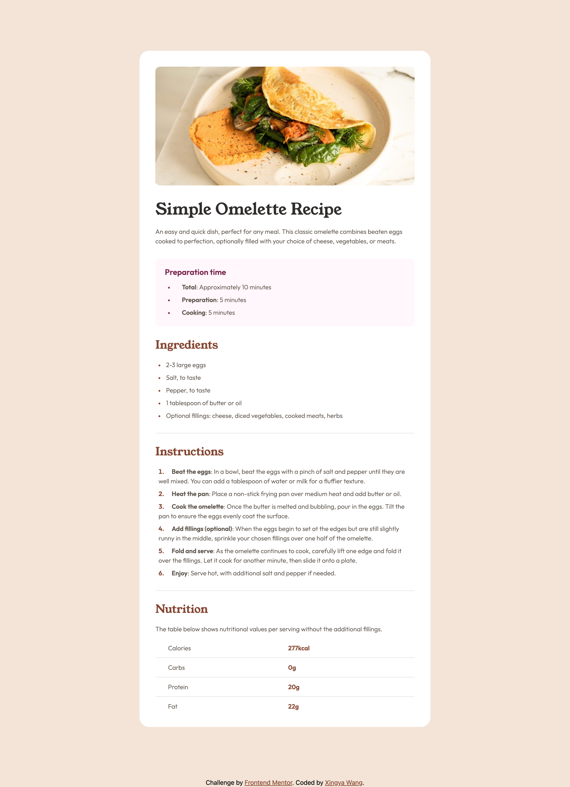

# Frontend Mentor - Recipe page solution

This is a solution to the [Recipe page challenge on Frontend Mentor](https://www.frontendmentor.io/challenges/recipe-page-KiTsR8QQKm). Frontend Mentor challenges help you improve your coding skills by building realistic projects. 

## Table of contents

- [Overview](#overview)
  - [The challenge](#the-challenge)
  - [Screenshot](#screenshot)
  - [Links](#links)
- [My process](#my-process)
  - [Built with](#built-with)
  - [What I learned](#what-i-learned)
  - [Useful resources](#useful-resources)
- [Author](#author)
- [Acknowledgments](#acknowledgments)

## Overview

### Screenshot



### Links

- Solution URL: [GitHub](https://github.com/frontend-mentor-projects-repo/recipe-page-main)
- Live Site URL: [Live Site](https://frontend-mentor-projects-repo.github.io/recipe-page-main)

## My process

### Built with

- Semantic HTML5 markup
- CSS custom properties
- Flexbox
- [Tailwind CSS](https://tailwindcss.com/) - CSS library - `Play CDN` version

### What I learned

In this project, I learned to gain familiarity working with Tailwind CSS. It's a lot of fun using Tailwind compared to the traditional CSS stylesheet, e.g. 
* one does not need to go back and forth between two scripts
* no need to come up with the most creative class/id names

For example, in order to achieve the effect
```css
.myclass {
  font-weight: bold;
}
```
One can just do
```html
<p class="font-bold">Some HTML code I'm proud of</p>
```

Moreover, I think I am more comfortable with plotting out the basic structure/components of the design first, and then go about planning the design using the Tailwind CSS classes. (For example, check the `index.html` script, where I used `id` to indicate what the structure/layer of the current component is.)

### Useful resources

- [Tailwind CSS Official Doc](https://tailwindcss.com/) - it's a good resource for reference: do a quick search on CSS tags to get the corresponding Tailwind classes.


## Author

- GitHub - [@wxyzz22](https://github.com/wxyzz22)
- Frontend Mentor - [@wxyzz22](https://www.frontendmentor.io/home)
- LinkedIn - [Xingya Wang](https://www.linkedin.com/in/xingya-wang/)

## Acknowledgments

Special thanks to my mentor [@HarryLyons](https://github.com/GregLyons) for guidance and advice. And thanks for ChatGPT for saving my time searching on Google.
